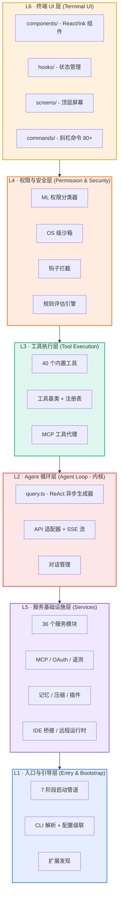
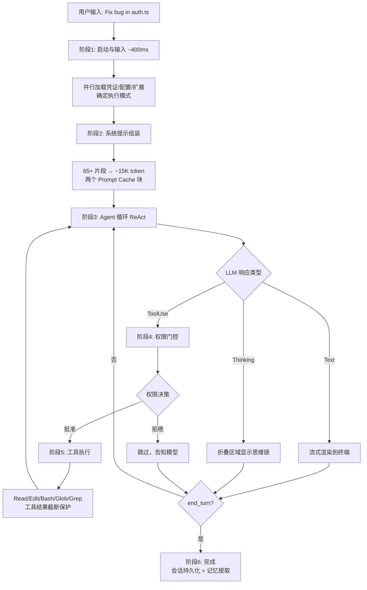
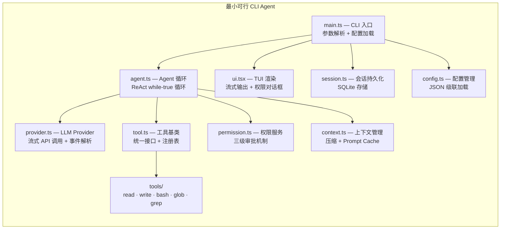

# CLI Agent 架构深度解析 — Claude Code & OpenCode

> **Claude Code 与 OpenCode 的分层架构、核心组件与设计模式全景**
>
> `Claude Code · TypeScript` | `OpenCode · Go` | `2026-06-27`

---

## 目录

1. [项目概览与对比](#1-项目概览与对比)
2. [Claude Code 六层架构](#2-claude-code-六层架构)
3. [OpenCode 六层架构](#3-opencode-六层架构)
4. [Claude Code 各层详解](#4-claude-code-各层详解)
5. [OpenCode 各层详解](#5-opencode-各层详解)
6. [架构对比总览](#6-架构对比总览)
7. [六大核心设计模式](#7-六大核心设计模式)
8. [端到端查询流程](#8-端到端查询流程)
9. [扩展机制](#9-扩展机制)
10. [仿制实现指南](#10-仿制实现指南)
11. [参考来源](#11-参考来源)

---

## 1. 项目概览与对比

CLI Agent（命令行 AI 编码代理）是一种在终端中运行、通过大语言模型（LLM）自主完成编程任务的工具。它们的核心循环极其简单：**调用模型 → 运行工具 → 重复**，直到任务完成。但围绕这个循环构建的子系统却非常庞大且精密。[1][2]

| 维度 | Claude Code | OpenCode (Go 版) |
|------|-------------|-----------------|
| **开发商** | Anthropic | 社区 (sst/opencode-ai) |
| **核心语言** | TypeScript (~512K LOC) | Go |
| **TUI 框架** | React + Ink (fork 版本) | Bubble Tea (Charm 生态) |
| **状态管理** | Zustand | PubSub 事件总线 |
| **架构模式** | 单进程，模块化分层 | 单进程，模块化分层 |
| **数据库** | 文件追加式存储 | SQLite + sqlc |
| **Agent 循环** | 异步生成器 (ReAct) | for 循环 + channel (ReAct) |
| **工具数量** | ~40 个 | ~12 个 + MCP |
| **沙箱** | Bubblewrap / Seatbelt / unshare | 无 OS 级沙箱 |
| **上下文管理** | 5 层压缩管道 | Token 95% 阈值自动摘要 |
| **多 Provider** | Claude 为主，兼容 xAI/OpenAI | 10+ (Claude/GPT/Gemini/Bedrock 等) |
| **开源状态** | 闭源核心 + 开源包装仓库 | Go 版已归档，TS 版活跃开发 |

---

## 2. Claude Code 六层架构

Claude Code 采用 **六层分层架构**，按职责划分为前端表现层和后端引擎层两大群组。整体代码量约 512K 行 TypeScript，包含 1,884 个源文件。[2][4]



**图 1：Claude Code 六层架构总览**

### 两层群组划分

| 群组 | 层级 | 代码量占比 |
|------|------|-----------|
| **前端层** | L6 终端 UI | ~140K LOC (27%) |
| **后端层** | L1~L5 引擎 + 服务 | ~320K LOC (62%) |

---

## 3. OpenCode 六层架构

OpenCode (Go 版) 同样采用 **六层分层架构**，但设计理念更简洁，所有组件运行在同一 Go 进程中，通过 pubsub 泛型事件总线解耦。[5][7]

```mermaid
graph TB
    subgraph CL1["L1 · CLI 入口层 (cmd/)"]
        A1[Cobra 命令框架]
        B1[参数解析]
        C1[模式分发]
    end
    subgraph CL2["L2 · TUI 表现层 (internal/tui/)"]
        A2[Bubble Tea TUI]
        B2[布局 / 页面 / 组件]
        C2[主题系统]
    end
    subgraph CL3["L3 · 应用编排层 (internal/app/)"]
        A3[App 结构体 - 核心中枢]
        B3[会话 / 消息 / 权限]
        C3[LSP / Agent 生命周期]
    end
    subgraph CL4["L4 · Agent/LLM 编排层 (internal/llm/)"]
        A4[Agent 循环 - processGeneration]
        B4[Provider 适配 10+]
        C4[提示词 / 模型定义]
    end
    subgraph CL5["L5 · 工具执行层 (internal/llm/tools/)"]
        A5[12 个内置工具]
        B5[MCP 外部工具]
        C5[子 Agent 工具]
    end
    subgraph CL6["L6 · 基础设施层"]
        A6[PubSub 事件总线]
        B6[SQLite 持久化]
        C6[权限 / LSP / 配置]
    end

    CL1 --> CL2
    CL2 --> CL3
    CL3 --> CL4
    CL4 --> CL5
    CL5 --> CL6

    style CL1 fill:#3b82f622,stroke:#3b82f6,stroke-width:2px
    style CL2 fill:#f59e0b22,stroke:#f59e0b,stroke-width:2px
    style CL3 fill:#8b5cf622,stroke:#8b5cf6,stroke-width:2px
    style CL4 fill:#ef444422,stroke:#ef4444,stroke-width:2px
    style CL5 fill:#10b98122,stroke:#10b981,stroke-width:2px
    style CL6 fill:#2a2a3a,stroke:#555,stroke-width:2px
```



**图 2：OpenCode 六层架构总览**

---

## 4. Claude Code 各层详解

### L1 · 入口与引导层

> `entrypoints/` · `bootstrap/` · `setup.ts` · `main.tsx` · `cli/` · `constants/`

**职责：**应用启动、凭证加载、配置读取、扩展发现、特性标记管理。

- **7 阶段启动管道：**预获取 → 警告处理 → CLI 解析 → setup + 并行加载 → 延迟初始化（信任门控后） → 模式路由 → 查询引擎循环
- **配置级联：**用户级 `~/.claude/settings.json` → 项目级 `claude.json` → 本地覆盖 `.claude.local`
- **6 种执行模式：**Local / Remote / SSH / Teleport / Direct-Connect / Deep-Link
- **88 个编译时特性标记 + 50+ 运行时特性门控**

### L2 · Agent 循环层（内核）

> `query.ts` (~1,729行) · `QueryEngine.ts` · `query/` · `services/api/`

**职责：**ReAct 循环核心、API 调用、流式响应解析、对话管理。

- **query.ts：**异步生成器，实现"思考→行动→观察"模式，是整个系统的"心脏"
- **响应解析：**三种块类型 — Text blocks（推理）、Thinking blocks（思维链）、tool_use blocks（工具调用）
- **终止守卫：**轮次计数器（硬上限）、Stop Hooks（收敛检查）、`end_turn` 信号
- **SSE 流式传输：**通过 Anthropic Messages API 实时获取 token

### L3 · 工具执行层

> `tools/` (40个工具) · `Tool.ts` · `tools.ts`

**职责：**所有工具实现、统一接口管理、工具结果截断。

- **统一 Strategy 模式：**所有工具继承 `Tool.ts` 基类，通过 `tools.ts` 注册表管理
- **核心工具：**BashTool、FileRead/Edit/WriteTool、GlobTool、GrepTool、WebFetch/SearchTool、MCPTool、AgentTool、LSPTool 等
- **工具结果截断：**超过阈值自动截断并告知模型，保护上下文窗口
- **延迟加载：**ToolSearchTool 支持按需动态发现工具

### L4 · 权限与安全层

> `hooks/toolPermission/` · `utils/sandbox/` · `schemas/`

**职责：**权限评估管道、ML 分类器、OS 级沙箱、钩子拦截。

- **5 级权限分级：**ReadOnly → WorkspaceWrite → DangerFullAccess → Prompt → Allow
- **授权管道：**预过滤 → PreToolUse 钩子 → 规则评估 → 权限处理器
- **OS 沙箱：**Linux Bubblewrap/unshare namespace 隔离、macOS Seatbelt 沙箱
- **ML 分类器：**Auto-Mode 中使用机器学习判断操作安全性（用户 93% 提示都批准）
- **信任门控：**插件/技能/MCP 仅在用户审核后才初始化

### L5 · 服务基础设施层

> `services/` (36个服务) · `tasks/` · `coordinator/` · `bridge/` · `remote/`

**职责：**API 适配、上下文压缩、MCP 管理、遥测、记忆、插件、IDE 桥接。

- **36 个服务模块：**api、compact、mcp、analytics、oauth、teamMemorySync、lsp、voice、MagicDocs、SessionMemory 等
- **5 层上下文压缩管道：**Budget Reduction → Snip → Microcompact → Context Collapse → Auto-compact
- **Prompt Caching：**系统提示分两个缓存块（核心指令 + 项目配置），TTL 5 分钟，降低 ~85% 成本
- **多代理协调器：**5 种专门化子代理（generalPurpose / explore / plan / verification / guide）
- **4 种扩展机制：**MCP、Plugins、Skills (SKILL.md)、Hooks

### L6 · 终端 UI 层

> `components/` · `hooks/` · `ink/` · `commands/` · `screens/` · `keybindings/` · `vim/`

**职责：**终端渲染、权限对话框、流式 Markdown、多行输入、状态栏。

- **React + Ink：**使用 fork 版本的 Ink 将 React 组件渲染到终端
- **核心组件：**App.tsx（根组件）、PermissionDialog、MessageStream、InputArea、StatusBar、ToolViews
- **207 个斜杠命令** 通过 commands/ 注册
- **Vim 模式**、伴侣精灵 (buddy)、主题系统

---

## 5. OpenCode 各层详解

### L1 · CLI 入口层

> `cmd/root.go` · `main.go`

**职责：**Cobra 命令解析、配置加载、数据库连接、App 实例创建。

- **Cobra 框架：**定义 CLI 参数 (-d debug, -c cwd, -p prompt, -f format, -q quiet)
- **启动序列：**`config.Load` → `db.Connect` → `app.New` → `initMCPTools` → 模式分发
- **PubSub 桥接：**在 `setupSubscriptions()` 中将所有服务事件桥接到 TUI 的 `tea.Msg` channel

### L2 · TUI 表现层

> `internal/tui/` · `layout/` · `page/` · `components/` · `theme/` · `styles/`

**职责：**Bubble Tea TUI 主模型、布局、页面、可复用组件、主题系统。

- **Bubble Tea：**Elm Architecture (Model-Update-View) 的 Go TUI 框架
- **Lipgloss：**终端样式渲染
- **Glamour：**终端 Markdown 渲染
- **主题：**Catppuccin、Dracula、TokyoNight、Flexoki
- **图片渲染：**基于 disintegration/imaging 在终端渲染图片

### L3 · 应用编排层

> `internal/app/app.go`

**职责：**App 结构体作为核心枢纽，组装并管理所有子服务。

```go
type App struct {
    Sessions    session.Service
    Messages    message.Service
    History     history.Service
    Permissions permission.Service
    CoderAgent  agent.Service
    LSPClients  map[string]*lsp.Client
}
```

- **服务聚合：**Sessions、Messages、History、Permissions、CoderAgent、LSPClients
- **工具组装：**`CoderAgentTools()` 组合内置 + MCP + LSP 工具集
- **非交互模式：**`RunNonInteractive()` 处理单次提示
- **生命周期管理：**`Shutdown()` 优雅关闭所有客户端和 watcher

### L4 · Agent/LLM 编排层

> `internal/llm/agent/` · `provider/` · `prompt/` · `models/`

**职责：**Agent 循环、Provider 多模型适配、流式处理、提示词管理。

- **Agent 循环：**`processGeneration()` — for 循环中调用 Provider.StreamResponse()，处理 ToolUse 事件，执行工具，反馈结果
- **Provider 接口：**`SendMessages()` (同步) + `StreamResponse()` (流式 channel)
- **泛型工厂：**`baseProvider[C]` 泛型实例，支持 10+ Provider（Anthropic/OpenAI/Gemini/Bedrock/Azure/Copilot/VertexAI/Groq/OpenRouter/xAI）
- **双 Agent 类型：**Coder Agent（完整工具集） + Task Agent（只读工具集）
- **费用追踪：**`TrackUsage()` 计算输入/输出/缓存 token 费用

### L5 · 工具执行层

> `internal/llm/tools/` · `bash.go` · `edit.go` · `write.go` · `patch.go` 等

**职责：**12 个内置工具实现、MCP 外部工具、子 Agent 工具。

```go
type BaseTool interface {
    Info() ToolInfo
    Run(ctx context.Context, params ToolCall) (ToolResponse, error)
}
```

| 工具 | 文件 | 功能 | 需要权限 |
|------|------|------|---------|
| `bash` | `bash.go` | 执行 Shell 命令 | 是 |
| `edit` | `edit.go` | 编辑文件 | 是 |
| `patch` | `patch.go` | 应用 diff 补丁 | 是 |
| `write` | `write.go` | 写入文件 | 是 |
| `view` | `view.go` | 查看文件内容 | 否 |
| `glob` | `glob.go` | 文件模式匹配 | 否 |
| `grep` | `grep.go` | 内容正则搜索 | 否 |
| `ls` | `ls.go` | 列出目录 | 否 |
| `fetch` | `fetch.go` | 抓取 URL 内容 | 是 |
| `diagnostics` | `diagnostics.go` | LSP 诊断信息 | 否 |
| `sourcegraph` | `sourcegraph.go` | Sourcegraph 代码搜索 | 否 |
| `agent` | `agent-tool.go` | 子 Agent 任务 | 否 |

- **MCP 集成：**通过 `mark3labs/mcp-go` 库接入外部工具
- **权限标记：**每个工具声明是否需要用户审批

### L6 · 基础设施层

> `internal/pubsub/` · `db/` · `permission/` · `lsp/` · `session/` · `config/`

**职责：**事件总线、持久化、权限、LSP、会话、配置。

- **PubSub：**泛型 `Broker[T]` + `Subscriber[T]`，所有核心服务都内嵌 Broker
- **SQLite + sqlc：**类型安全的数据库访问，goose 迁移
- **权限服务：**三级粒度 — 单次批准 / 会话级永久 / 拒绝
- **LSP 客户端：**STDIO 通信，文件变更通知，诊断信息反馈
- **文件历史：**追踪所有变更，支持回退/撤销

---

## 6. 架构对比总览

| 架构层 | Claude Code | OpenCode | 共同职责 |
|--------|------------|----------|---------|
| **CLI 入口** | entrypoints/ + 7 阶段管道 | cmd/root.go (Cobra) | 参数解析、配置加载、模式分发 |
| **TUI 表现** | React + Ink (fork) | Bubble Tea + Lipgloss | 终端渲染、输入处理、权限对话框、流式输出 |
| **应用编排** | 分散在 hooks/ + state/ | app.go (App 结构体) | 服务组装、生命周期、事件协调 |
| **Agent 循环** | query.ts (异步生成器) | agent.go (processGeneration) | ReAct 循环、API 调用、流式解析、工具调用决策 |
| **工具执行** | ~40 个工具 (Tool.ts 基类) | ~12 个工具 (BaseTool 接口) | 文件读写、Shell、搜索、Web、MCP 代理 |
| **权限安全** | ML 分类器 + OS 沙箱 | 用户审批对话框 | 操作拦截、权限分级、用户确认 |
| **上下文管理** | 5 层压缩 + Prompt Caching | 95% 阈值自动摘要 | 上下文窗口保护、对话历史压缩 |
| **基础设施** | services/ (36 个服务) | pubsub/ + db/ + permission/ | 持久化、遥测、Provider 适配、扩展管理 |

### Claude Code 各层代码量分布（K LOC）

```
L1 入口引导  ████████████████████████████████████  180K
L2 Agent循环 ██████████                            53K
L3 工具执行  ██████████                            51K
L4 权限安全  ████                                 19K
L5 服务设施  ████████████████████████              82K
L6 终端UI    ██████████████████████████████████    140K
```

### 两个项目的工具数量对比

```
            Claude Code    OpenCode
文件操作      5              4
Shell执行     3              2
搜索/匹配     3              3
Web/网络      3              1
MCP代理       2              1
Agent/子任务  2              1
LSP集成       1              1
其他         21              0
```

---

## 7. 六大核心设计模式

### 7.1 ReAct 循环（核心驱动）

两个项目都采用 **ReAct (Reasoning + Acting)** 模式作为核心循环。用户输入后，Agent 进入循环：LLM 生成包含推理文本和工具调用的响应 → 执行工具 → 将结果反馈给 LLM → 继续循环直到模型不再调用工具。

**Claude Code 实现：**

```typescript
// query.ts - 异步生成器 (~1,729行)
async *run(query) {
  while (true) {
    const response = await api.stream();
    for (const block of response.blocks) {
      if (block.type === 'tool_use') {
        yield* executeTool(block);
      }
    }
    if (response.stop_reason === 'end_turn') break;
  }
}
```

**OpenCode 实现：**

```go
// agent.go - processGeneration()
for {
    events := provider.StreamResponse(ctx, msgs, tools)
    for event := range events {
        switch e := event.(type) {
        case ToolUseStart:
            // 收集工具调用
        case Complete:
            if e.FinishReason != ToolUse { return }
        }
    }
    // 执行工具 → 追加结果 → 继续
}
```

### 7.2 工具注册与策略模式

所有工具都通过统一接口抽象，使用策略模式实现可替换的工具执行。Claude Code 使用 `Tool.ts` 基类 + `tools.ts` 注册表；OpenCode 使用 `BaseTool` Go 接口。每个工具声明元信息（名称、描述、参数 schema）和执行逻辑，Agent 循环通过工具名查找并调度。

### 7.3 Provider 适配器模式

两个项目都通过 **Provider 抽象层** 支持多个 LLM 服务商。Claude Code 以 Anthropic API 为主，兼容 xAI/OpenAI；OpenCode 通过泛型 `baseProvider[C]` 支持 10+ Provider。核心思路是统一流式事件接口，将不同 API 的差异封装在 Provider 内部。

### 7.4 上下文窗口管理

**这是 CLI Agent 最复杂的子系统。** 随着对话增长，消息会耗尽 LLM 的上下文窗口。两个项目都实现了自动压缩策略：

> **Claude Code — 五层压缩管道：**Budget Reduction → Snip → Microcompact → Context Collapse → Auto-compact。系统提示分为两个 Prompt Cache 块，TTL 5 分钟，可降低 ~85% 成本。[1]
>
> **OpenCode — 阈值触发：**当 token 使用达到模型上下文窗口 95% 时，自动调用 SummarizeProvider 生成摘要，创建新 session 从摘要处继续。[5]

### 7.5 权限与安全纵深防御

CLI Agent 拥有执行任意 Shell 命令的能力，因此安全是核心关切。Claude Code 构建了 **七级纵深防御**：ML 分类器 → 规则引擎 → PreToolUse 钩子 → OS 级沙箱 (Bubblewrap/Seatbelt) → 信任门控 → 权限分级 → 用户确认对话框。OpenCode 采用更简洁的三级粒度权限（单次/会话/拒绝），通过 pubsub 将权限请求路由到 TUI 对话框。

### 7.6 事件驱动解耦

OpenCode 使用 **泛型 PubSub 事件总线** 解耦所有服务，Agent/Session/Message/Permission 都内嵌 `Broker[T]`。Claude Code 使用 React 的单向数据流 + Zustand 状态管理，配合 React Hooks 实现响应式 UI 更新。两者都实现了松耦合的事件通知机制。

---

## 8. 端到端查询流程

以下展示从用户输入到最终输出的完整数据流：



**图 5：端到端查询流程**

> **关键性能数据：**系统提示约消耗 15K / 200K token，通过 Prompt Caching 可降低 ~85% 的重复计算成本。工具输出超过阈值时自动截断，防止单个工具调用耗尽上下文窗口。整个循环是 while-true，由终止守卫（轮次上限 + Stop Hooks + end_turn 信号）控制退出。[2]

### Claude Code 七阶段启动管道

```
Stage 1: 预获取副作用（并行执行）
Stage 2: 警告处理器 + 环境守卫
Stage 3: CLI 解析器 + 预操作信任门控
Stage 4: setup() + 命令/代理并行加载
Stage 5: 延迟初始化（插件、技能、MCP、钩子）-- 信任门控
Stage 6: 模式路由（本地/远程/SSH/Teleport/Direct-Connect/Deep-Link）
Stage 7: 查询引擎提交循环
```

### OpenCode 完整启动序列

```
main.go → cmd.Execute()
  ├── config.Load(cwd, debug)         // 加载 .opencode.json 配置
  ├── db.Connect()                     // SQLite 连接 + goose 迁移
  ├── app.New(ctx, conn)              // 创建 App 核心
  │   ├── session.NewService(q)
  │   ├── message.NewService(q)
  │   ├── history.NewService(q)
  │   ├── permission.NewPermissionService()
  │   ├── agent.NewAgent("coder", ...)
  │   │   ├── createAgentProvider()
  │   │   ├── createAgentProvider("title")
  │   │   └── createAgentProvider("summarizer")
  │   └── initLSPClients(ctx)
  ├── initMCPTools(ctx, app)
  │
  ├── [交互模式]:
  │   ├── tea.NewProgram(tui.New(app))
  │   ├── setupSubscriptions()         // 桥接 pubsub → TUI
  │   └── program.Run()
  │
  └── [非交互模式]:
      ├── sessions.Create(title)
      ├── permissions.AutoApproveSession(sess.ID)
      ├── coderAgent.Run(ctx, sess.ID, prompt)
      └── format.FormatOutput() → stdout
```

---

## 9. 扩展机制

CLI Agent 的扩展能力决定了其生态上限。Claude Code 提供了四种互补的扩展机制[1]，OpenCode 主要通过 MCP 和配置文件实现：

| 扩展机制 | 描述 | Claude Code | OpenCode |
|---------|------|------------|----------|
| **MCP 服务器** | 外部工具提供者协议 | 支持 6 种传输，含 OAuth | mark3labs/mcp-go |
| **Plugins** | 可分发的扩展包 | 含自定义命令和代理 | 无 |
| **Skills** | SKILL.md 领域知识注入 | 注入系统提示 | 配置文件上下文 |
| **Hooks** | 生命周期钩子拦截 | Pre/Post ToolUse, Stop, Notification | 无内置钩子 |

### Claude Code 多代理编排

Claude Code 内置 **专门化子代理**，每个有不同角色：

| 代理 | 角色 |
|------|------|
| `generalPurposeAgent` | 通用多步骤任务 |
| `exploreAgent` | 快速代码库探索 |
| `planAgent` | 实现规划与架构设计 |
| `verificationAgent` | 测试与验证 |
| `claudeCodeGuideAgent` | 自文档与帮助 |

子代理运行在独立的上下文中，通过 `AgentTool` 派生，拥有独立的对话历史（sidechain transcripts），完成后向父代理返回摘要。

---

## 10. 仿制实现指南

如果你要构建一个同款 CLI Agent，以下是基于两个项目共性提取的 **最小可行架构蓝图**。

### 技术栈选型建议

| 组件 | TypeScript 方案 (推荐) | Go 方案 |
|------|----------------------|---------|
| **CLI 框架** | commander / yargs | Cobra |
| **TUI 框架** | Ink (React for CLI) | Bubble Tea |
| **状态管理** | Zustand | PubSub 事件总线 |
| **数据库** | better-sqlite3 | SQLite + sqlc |
| **LLM SDK** | @anthropic-ai/sdk | anthropic-sdk-go |
| **流式传输** | SSE / fetch ReadableStream | channel |
| **终端渲染** | chalk + ansi-to-html | Lipgloss + Glamour |
| **MCP** | @modelcontextprotocol/sdk | mark3labs/mcp-go |

### 核心模块清单（最小可行版本）



**图 6：最小可行 CLI Agent 模块图**

### 实现优先级（按阶段）

1. **阶段 1 — MVP**：CLI 入口 + Agent 循环 + 单一 Provider + 3 个基础工具 (read/write/bash) + 简单 TUI 输出
2. **阶段 2 — 增强**：权限系统 + 流式输出 + glob/grep 工具 + 会话持久化 (SQLite) + 配置文件
3. **阶段 3 — 生态**：MCP 集成 + 多 Provider 适配 + 上下文压缩管道 + Prompt Caching
4. **阶段 4 — 高级**：OS 沙箱 + ML 权限分类器 + 子 Agent 编排 + Hooks/Plugins/Skills 扩展 + 远程执行

### 关键实现要点

> **1. Agent 循环是心脏：**先实现最简的 while-true 循环（调用 API → 解析 tool_use → 执行工具 → 反馈结果），这是整个系统的核心。
>
> **2. 流式输出是体验：**用户需要看到实时的 token 输出，SSE/ReadableStream (TS) 或 channel (Go) 是基础。
>
> **3. 上下文管理是难点：**上下文窗口会耗尽，必须实现压缩策略。最简方案是达到阈值时用独立模型生成摘要。
>
> **4. 权限系统是底线：**Shell 执行必须经过用户确认。先实现简单的 Allow/Deny 对话框，再逐步增加规则引擎和 ML 分类器。
>
> **5. 工具接口是扩展点：**设计好 BaseTool 接口（Info + Run），后续添加新工具只需实现接口并注册。

---

## 11. 参考来源

1. [arXiv 2604.14228] Dive into Claude Code: The Design Space of Today's and Future AI Agent Systems — https://arxiv.org/html/2604.14228
2. y-agent.github.io — Inside Claude Code: End-to-End Workflow — https://y-agent.github.io/inside-claude-code/01-end-to-end-workflow.html
3. y-agent.github.io — Inside Claude Code: Bird's Eye Architecture — https://y-agent.github.io/inside-claude-code/00-birds-eye-architecture.html
4. redaugment.com — Deconstructing Claude Code: What 1,902 Leaked Source Files Reveal — https://www.redaugment.com/company/blogs/deconstructing-claude-code-leaked-source-analysis
5. cefboud.com — How Coding Agents Actually Work: Inside OpenCode — https://cefboud.com/posts/coding-agents-internals-opencode-deepdive/
6. GitHub: sst/opencode — https://github.com/sst/opencode
7. GitHub: opencode-ai/opencode — https://github.com/opencode-ai/opencode
